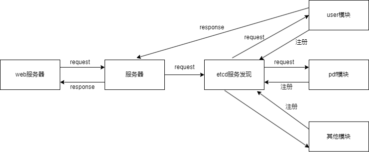
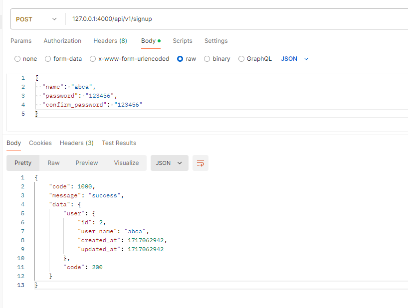
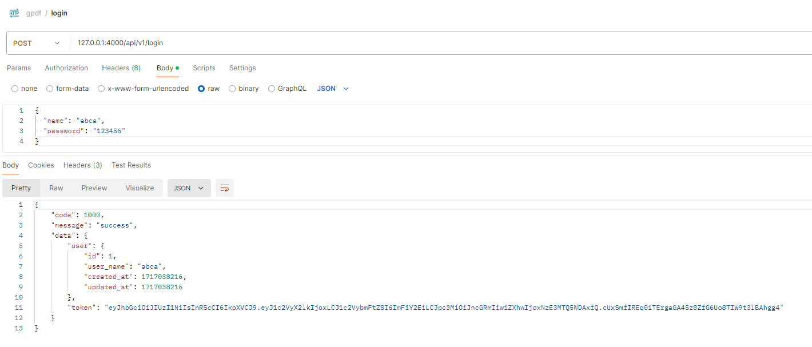
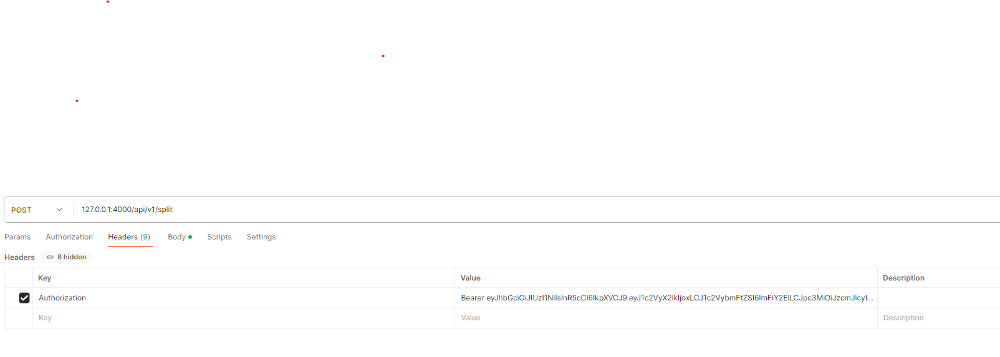
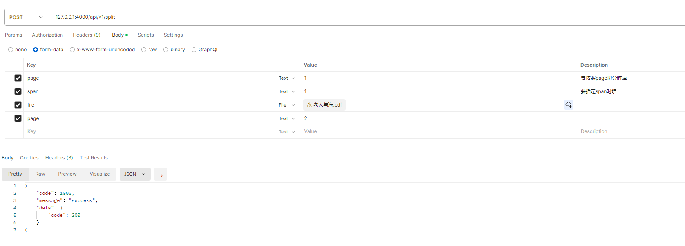
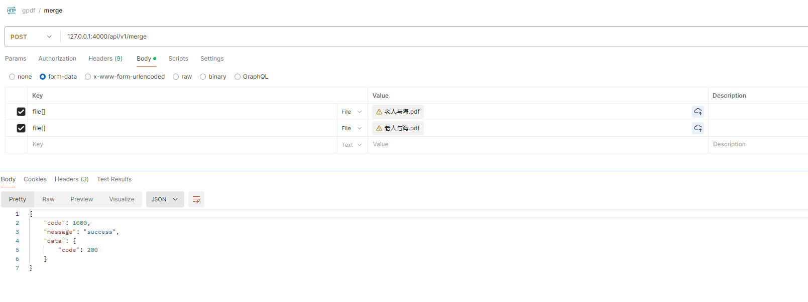
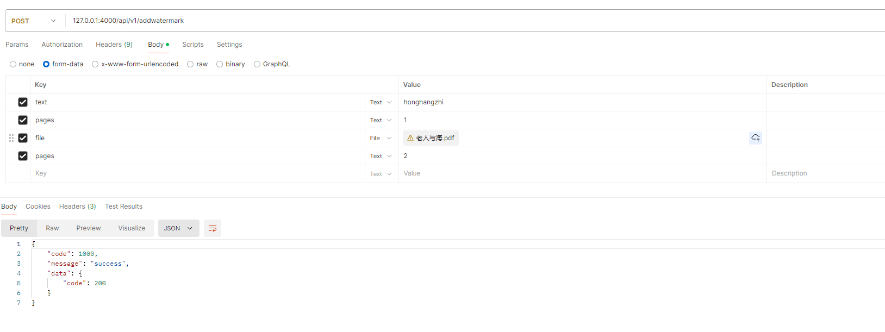

# gpdf
pdf操作微服务系统


## 项目结构

```
├─.idea
├─app                             // 各个微服务
│  ├─gateway                      // 网关
│  ├─pdf                          // pdf工具服务
│  └─user                         // 注册登录服务
├─bin                             // 编译后的二进制文件模块
├─config                          // 配置文件
├─doc                             // 接口文档
├─enums                           //各种常量
├─logs                            //日志文件
├─pdf_file                        //pdf中间文件
│  ├─input
│  └─output
├─pkg                             //各种包
│  ├─db                           //mysql相关
│  ├─logger                       //日志
│  └─utils                        //工具 jwt等
└─proto                           // protoc文件
```


## 架构



## 配置

在conf目录下的 gpdf.yaml 文件配置各服务端口号等

## 部署

1. 使用docker启动相关服务（mysql等）
   ```sh
   docker compose up -d
   ```

2. 启动各个微服务
   ```go
   go build github.com/adnpa/gpdf/app/user/cmd
   go build github.com/adnpa/gpdf/app/pdf/cmd
   go build github.com/adnpa/gpdf/app/gateway/cmd
   ```

   

## 测试

可使用postman等工具调用http服务，postman相关配置已导出在 doc目录下gpdf.postman_collection.json文件

### 注册



### 登录



### pdf相关操作

pdf相关操作需要在请求中添加jwt ，即登录接口的resp中的token



#### 拆分



#### 合并



#### 添加水印




